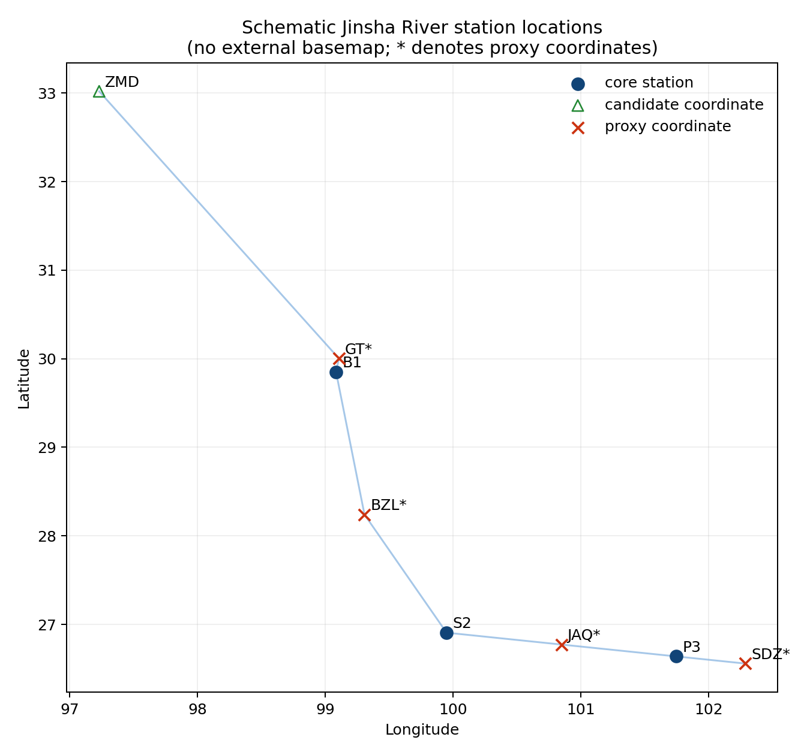

# A Case-Study Covariance Heuristic for Stream-Temperature Recoverability

A reproducible study of how reservoir regulation reshapes the information
available to recover daily stream temperature under monitoring outages.



This repository implements the data, masking, model-selection, experiment,
confirmation, and analysis pipeline for a three-station Upper Jinsha River case
study. The primary task is offline reconstruction of stream temperature (`T`);
discharge (`F`) and water level (`L`) are secondary targets and information
sources. A separate online protocol is strictly causal.

The scientific contribution is a reproducible case-study screen, not a
confirmatory reservoir mechanism. In two documented networks, dam-proximal
stations are labelled memory-dominated by a train-only covariance heuristic.
Controlled masks probe that information structure; they are not observed fault
records. An independently frozen 335-site panel adds a generalization boundary:
the index weakens with distance below major dams but is not a valid standalone
dam classifier. The frozen pooled leave-one-ecoregion-out AUC is retained only
as a defective diagnostic.

## Evidence status

The block below is deliberately machine-readable. It records the status of the
current frozen protocol, not the existence of runnable code or historical
artifacts.

<!-- evidence-status:start -->
```json
{
  "design_freeze": "design_freeze_v4",
  "development_test_visibility": "seen_before_design_freeze",
  "validation_funnel": "complete_selection_only",
  "finalized_model_roster": "finalized",
  "analytic_recoverability_prediction": "frozen_train_only_before_dense_aggregate",
  "development_test_formal_evidence": "complete_current_protocol",
  "confirmatory_data": "built_feasibility_passed",
  "confirmatory_evaluation": "complete_evaluate_once_540_of_540",
  "external_validation_placement_scale": "complete_20_seeds_no_confirmatory_access",
  "p3_change_point": "complete_method_sensitive",
  "national_regulation_panel": "complete_transport_limited_primary_null_N335",
  "public_history": "code_only_rewrite_complete_zero_restricted_paths",
  "github_release": "v1.0.0",
  "archival_doi": "pending",
  "current_protocol_result_claims": "case_study_descriptive_inference_withheld"
}
```
<!-- evidence-status:end -->

下一篇换问题，计划写在
[`docs/research_charter_v1.md`](docs/research_charter_v1.md)。
现在这篇金沙江稿子的结果不重开。假河网检验：`make recoverability-framework`。
公开目录核验：`python scripts/46_check_public_rivers.py`。

The v5 scope amendment is recorded in
`docs/protocol_change_v4_to_v5.md`; major-review corrections are recorded in
`docs/protocol_change_v5_to_v6.md`. CSDI is a reduced probabilistic diagnostic,
not a formal frontier model. Deep candidates with any required
`best_epoch < 50` are labelled `training_unstable` and excluded. The primary
question is whether the frozen covariance heuristic predicts measured
recoverability, not which imputation model wins.

In particular:

- 2018–2020 is called `development_test`. It was visible before
  `design_freeze_v1` and is not presented as a previously unseen test set.
  The executable freeze is now `design_freeze_v4`. v1 and v2 remain historical.
- Model selection is now restricted to 2016–2017 validation data and must end
  in a contract-validated `finalized_model_roster_v1` before any formal
  development-test or confirmatory execution.
- Smoke, truncated, partial, development-only, and validation-funnel runs are
  not performance evidence. A complete smoke manifest proves only that its
  four-scenario software check ran.
- The pre-freeze artifacts under `results/formal/` are explicitly invalid for
  inference; see `results/formal/PRE_FREEZE_INVALID.md`.
- Formal internal evidence and the external evaluate-once bundle are complete.
  Reviewer-triggered state controls remain explicitly post-hoc.

## Frozen study design

| Item | Frozen definition |
| --- | --- |
| Internal stations | Batang (`B1`), Shigu (`S2`), Panzhihua (`P3`) |
| River system | Upper Jinsha River, China |
| Resolution | Daily |
| Internal record | 1 January 2006–31 December 2020 |
| Fit split | 2006–2015 (`train`) |
| Selection split | 2016–2017 (`validation`) |
| Development evaluation | 2018–2020 (`development_test`; stored-data alias `test`) |
| Primary target | Stream temperature (`T`) |
| Secondary targets | Discharge (`F`) and water level (`L`) |
| Meteorology | Air temperature (`Ta`), precipitation (`P`), wind (`W`), relative humidity (`RH`), surface shortwave radiation (`Rs`; NASA POWER `ALLSKY_SFC_SW_DWN`, MJ/m²/day). Jinsha sunshine duration (`DH`, hours) is sensitivity-only and is not the main Group D channel. |
| Main / dense windows | 368 / 736 days; 184 and 736 days are window sensitivities |
| Formal training seeds | `11`, `22`, `33`, `44`, `55` |
| Formal mask seeds | `101`–`120` |
| Internal data versions | `published_v2` plus three frozen provenance sensitivities; `published_v1` remains historical |
| Confirmatory design | One Upper–Middle Chattahoochee mainstem network panel (HUCs `03130001`/`03130002`; not Lower `03130004`; not five basins; not external M1), 2023–2025, evaluate once after roster freeze |

The authoritative contracts are
[`configs/design_freeze_v4.yaml`](configs/design_freeze_v4.yaml)
(executable) and the historical
[`configs/design_freeze_v2.yaml`](configs/design_freeze_v2.yaml) and
[`configs/design_freeze_v1.yaml`](configs/design_freeze_v1.yaml),
plus [`study_manifest.yaml`](study_manifest.yaml) and
[`configs/experiments.yaml`](configs/experiments.yaml). Protocol amendments
are [`docs/protocol_change_v1_to_v2.md`](docs/protocol_change_v1_to_v2.md)
[`docs/protocol_change_v2_to_v3.md`](docs/protocol_change_v2_to_v3.md), and
[`docs/protocol_change_v3_to_v4.md`](docs/protocol_change_v3_to_v4.md).
Variable definitions and provenance are documented in
[`metadata/data_dictionary.csv`](metadata/data_dictionary.csv) and
[`metadata/source_documentation/README.md`](metadata/source_documentation/README.md).

## Evidence architecture

The pipeline separates four roles that must not be pooled or relabelled:

1. **Implementation checks.** Smoke runs, standalone baselines, and the local
   BRITS-lite/SAITS-lite code test interfaces and failure handling.
2. **Validation-only selection.** A frozen 21-condition, 105-anchor-unit funnel
   selects the model roster on 2016–2017 data. Its artifacts carry
   `evidence_role: model_selection_only` and `formal_evidence: false`.
3. **Formal development evaluation.** Complete, roster-authorized suites run
   on `development_test`. Their manifests must match the frozen design, data
   version, masks, checkpoints, code identity, seeds, expected models, and
   run-unit inventory.
4. **External temporal confirmation.** The immutable Upper–Middle Chattahoochee
   mainstem bundle was opened after roster finalization. All 540 expected
   model--scenario units completed behind a persistent once-lock. This is one
   connected network panel, not five independent basins and not internal
   nested-point M1.

Formal aggregation is registry-driven. A `formal_suite_registry_v1` names
explicit completed run manifests; historical-directory discovery is not used.
The primary registry must cover the core/full, dense-frontier,
network-resilience, and event/uncertainty roles. Operational-dropout and
retrained-information roles are required only if the proposed model passes its
validation gate; otherwise they must be explicit not-applicable records.
Sensitivity registries are separate and must cover the prescribed roles for
each non-primary data version.

## Validation funnel and finalized roster

The validation grid contains seven strata at each internal station: a 30%
point mask; 10-, 30-, 90-, and 180-day `T` blocks; a synchronized 90-day
`T+F+L` block; and a 90-day hydrological station outage. Each stratum is bound
to five immutable station anchors from
[`metadata/validation_anchors.csv`](metadata/validation_anchors.csv).

Selection proceeds without development-test outcomes:

- **Stage 1:** nine traditional candidates.
- **Stage 2:** official PyPOTS BRITS, SAITS, and CSDI plus the proposed model,
  all at seed 11, followed by finite-value and convergence diagnostics.
- **Stage 3:** only retained deep candidates, using seeds 11, 22, and 33.
- **Proposed-model gate:** if the proposed model enters Stage 3, it must pass
  every frozen skill, seed-direction, calibration, station-robustness, and
  same-checkpoint branch-ablation criterion. If it is not retained at Stage 2,
  the gate records an early `framework_only` decision and a separate
  not-applicable branch-ablation artifact; it does not fabricate performance.
- **Roster freeze:** all artifacts and source identities are hash-checked
  before the immutable `finalized_model_roster_v1` is issued.

Formal `T` suites must use the exact finalized roster. Suites that also score
`F` or `L` add only the fixed structural `rating_curve` and
`independent_flow` baselines. If the proposed gate yields `framework_only`, the
proposed model and both information-attribution estimands are excluded from
formal claims.

## Models

The unified offline runner contains:

- **Temporal references:** train-only climatology, linear interpolation,
  PCHIP, and Kalman smoothing.
- **Regression and tree baselines:** `air_only`, `air_hydro`,
  `donor_regression`, random forest, and XGBoost.
- **Hydraulic structural baselines:** a same-site `rating_curve` and an
  explicitly level-free `independent_flow` model for applicable `F` tasks.
- **Official reference imputers:** `brits_ref`, `saits_ref`, and `csdi` use the
  official PyPOTS **1.5** cores. The dependency version and imported module
  origins are checked; the formal runner does not silently fall back to local
  approximations.
- **Development-only neural baselines:** `brits_lite` and `saits_lite` are
  compact local implementations. Legacy names `brits` and `saits` resolve to
  these lite models and are never formal reference results.
- **Proposed model:** a missing-aware multisource quantile imputer with a
  permanent baseline branch and four switchable information groups. Its
  cross-station component is masked attention, not a graph neural network.

The proposed model's information definition is fixed as follows:

| Group | Information available to the model |
| --- | --- |
| `S0` | Permanent leap-aware calendar features, train-only target climatology, and static station identity |
| `A` | Local target context before and after the gap and distance to observations |
| `B` | Same-site discharge and water level |
| `C` | Other-site temperature, discharge, and water level |
| `D` | Same-site air temperature, precipitation, wind, relative humidity, and surface shortwave radiation (`Rs`). Jinsha sunshine duration (`DH`, hours) is sensitivity-only, not the main Group D channel |

Two information estimands remain separate. Operational dropout evaluates `S0`
and all 15 non-empty A–D subsets with one shared checkpoint and permits exact
four-source Shapley allocation only after all 16 matched coalitions pass. The
retrained upper bound fits a distinct checkpoint for each of nine declared
coalitions (`S0`, `S0+A`, `S0+B`, `S0+C`, `S0+D`, `S0+A+B`, `S0+A+C`,
`S0+A+D`, and `S0+A+B+C+D`). The nine-coalition design supports bounded
contrasts, not exact Shapley values, and is never pooled with operational
dropout.

## Experiment inventory

Counts are generated by the current grid builders. A scenario is one condition
and mask realization; trainable-model seeds and information coalitions are
additional run-unit axes rather than extra scenarios in this table.

<!-- protocol-grid-counts: smoke=4/4 core=156/3120 full_catalog=1148/9299 full_without_catalog=444/8595 m6a=144/2880 m6b=36/720 m7a=12/12 m7b=704/704 dense=93/1860 compensation=12/240 resilience=96/1920 retrained=9/180 external=60/60 -->

| Suite | Conditions | Scenarios | Evidence use |
| --- | ---: | ---: | --- |
| Executable `smoke` | 4 | 4 | Integration check only |
| `core` (M1–M4) | 156 | 3,120 | Structured-gap formal role when complete and authorized |
| Formal `full` with frozen event catalog | 1,148 | 9,299 | M1–M10 plus all eligible M7b pairs |
| `full` without event catalog | 444 | 8,595 | Builder inventory only; **not a formal full suite** |
| `SCI_DENSE` | 93 | 1,860 | Nested recoverability frontiers |
| `SCI_COMPENSATION` | 12 | 240 | Operational 16-coalition dropout, conditional on proposed-model authorization |
| `SCI_NET` | 96 | 1,920 | Matched internal network failures |
| Retrained information | 9 | 180 | Base station–gap masks; nine coalitions form a separate training/run-unit axis, conditional on authorization |
| External confirmation | 60 | 60 | Five sites × six gap designs × two information conditions |

The formal full grid is composed as follows:

- **M1:** nested, season-balanced 10%, 30%, and 50% point masks for `T`, `F`,
  `L`, or `T+F+L`.
- **M2–M3:** centered single and fixed-budget multiblock gaps of 10, 30, 90,
  and 180 days for primary variable patterns.
- **M4:** 10–180-day hydrological or full-site outages.
- **M5:** single and multiblock secondary-target experiments for `F`, `L`, and
  `F+L`.
- **M6a:** 144 same-station, variable-axis asynchronous conditions and 2,880
  mask scenarios. `T+F`, `T+L`, `F+L`, and `T+F+L` channels receive equal
  length but asynchronously placed gaps at overlap ratios 1.0, 0.5, and 0.0.
- **M6b:** 36 cross-station asynchronous conditions and 720 scenarios for the
  three station pairs, four gap lengths, and three overlap ratios.
- **M7a:** 12 deterministic seed-0 aggregate stress cases: four event types at
  each station.
- **M7b:** the frozen catalog contains 355 event/control pairs, of which 352
  are analysis-eligible. Every eligible pair contributes one fixed event
  episode and one matched non-event control, giving 704 seed-0 scenarios.
- **M8:** 15 compact window-sensitivity anchors.
- **M9:** six seen/unseen 180-day training-length protocol conditions.
- **M10:** three deterministic internal leave-one-station-out diagnostics;
  these are exploratory and not external validation.

The dedicated dense design uses 15 declared `T` gaps from 1 to 365 days and
eight declared gaps for each of `F` and `L`, all on the frozen 736-day window.
The resilience design crosses three targets, four `T` gap lengths, and the
eight-element powerset of station failures. The 180-row frontier anchor catalog
provides five fixed anchors per season for every station–target group.

## Installation

Python 3.10 or newer is required. Formal reference models require the pinned
`reference` extra. GitHub Actions installs **from** the pip-tools lock
[`constraints.txt`](constraints.txt) on Python **3.10 and 3.11**:

```bash
python -m pip install --upgrade pip
python -m pip install \
  --extra-index-url https://download.pytorch.org/whl/cpu \
  -c constraints.txt \
  -e ".[dev,reference]"
```

A floating `pip install -e ".[dev,reference]"` without `-c constraints.txt` is
not the CI path and will not reproduce the locked tree.

```bash
git clone https://github.com/shutiao23/stream-recoverability.git
cd stream-recoverability

python3 -m venv .venv
source .venv/bin/activate
python -m pip install --upgrade pip
python -m pip install \
  --extra-index-url https://download.pytorch.org/whl/cpu \
  -c constraints.txt \
  -e ".[dev,reference]"
pytest
```

[`pyproject.toml`](pyproject.toml) keeps intent ranges (`numpy>=1.24,<3`,
`pandas>=2.0,<4`, `xgboost>=2.0,<3`, `pypots==1.5`). Exact versions live in
`constraints.txt`. [`environment.yml`](environment.yml) is a derived conda
wrapper around that lock, not a second source of truth.

The committed lock pins **CPU** PyTorch (`torch==2.13.0+cpu`) from
`https://download.pytorch.org/whl/cpu` so GitHub Actions does not download
CUDA torch. `nvidia-nccl-cu12` appears only as a Linux **XGBoost** wheel
dependency. For GPU training, install a CUDA torch of the same base version
from the matching PyTorch index (for example
`https://download.pytorch.org/whl/cu124`), then install the remaining tree
with `-c constraints.txt` after overriding the `+cpu` torch pin. Do not copy
CUDA torch wheels into the GitHub Actions lock.

The pre-validation compute budget is
[`results/compute_plan.json`](results/compute_plan.json) (candidate deep
models only; the formal roster is still pending).

## Safe smoke check

Prepared, versioned data are required. This command keeps demonstration
artifacts away from formal paths and uses only deterministic non-trainable
models:

```bash
python scripts/08_run_experiments.py \
  --suite smoke \
  --models climatology linear \
  --output-dir results/demo-smoke \
  --mask-dir masks/demo-smoke
```

It exercises one M1, M2, M3, and M4 scenario. It is not a benchmark and must
not be supplied to formal aggregation.

The older standalone mask/baseline path remains useful for implementation
checks:

```bash
python scripts/03_generate_masks.py --output masks/demo-fixed
python scripts/04_run_baselines.py \
  --masks masks/demo-fixed/test \
  --models climatology linear pchip \
  --output-dir results/demo-baselines
```

Standalone masks are not interchangeable with unified M1–M10 scenario
contracts.

## Numbered workflow

Script numbers identify stable entry points; the formal execution order is
gate-driven and therefore not simply numerical.

| Script | Responsibility |
| --- | --- |
| `01_audit_data.py` | Audit dates, missing codes, repeated runs, extremes, and hydraulic relationships. |
| `02_prepare_data.py` | Build aligned long/wide tables, chronological splits, and train-only scaling artifacts. |
| `03_generate_masks.py` | Generate the standalone validation/test mask library. |
| `04_run_baselines.py` | Run traditional baselines on standalone fixed masks. |
| `05_train_deep_baselines.py` | Train local BRITS-lite/SAITS-lite development models; not official references. |
| `06_train_proposed.py` | Run the proposed model's synthetic-only smoke training. |
| `07_run_eda.py` | Produce descriptive tables, event labels, QC plots, and study-area inputs. |
| `08_run_experiments.py` | Run unified smoke/core/full suites; formal core/full runs require a finalized roster. |
| `09_analyze_results.py` | Analyse one complete hash-verified frozen aggregate and its required sensitivities. |
| `10_run_online.py` | Run the separate strictly causal online supplement. |
| `11_make_figures.py` | Freeze figure/table inputs and generate only available publication outputs. |
| `12_run_science_experiments.py` | Run dense, resilience, operational-dropout, retrained-upper-bound, or descriptive training-information studies. |
| `13_aggregate_formal_results.py` | Fail closed while aggregating an explicit finalized suite registry. |
| `14_build_data_versions.py` | Build immutable `published_v1` and three provenance-sensitivity data versions. |
| `15_run_validation_funnel.py` | Run, diagnose, rank, gate, and freeze the validation-only model funnel. |
| `16_generate_frontier_anchors.py` | Generate the season-balanced nested-frontier anchor catalog. |
| `17_build_event_catalog.py` | Build or audit the deterministic M7b event/control catalog. |
| `18_generate_validation_anchors.py` | Generate the frozen five-anchor-per-station validation catalog. |
| `19_build_confirmatory_data.py` | Print the external request plan, or build immutable external data after roster authorization; never computes metrics. |
| `20_run_confirmatory_evaluation.py` | Preflight, `--feasibility-only` 60-mask dry-run, or execute the frozen external evaluation exactly once. |
| `21_build_formal_suite_registry.py` | Build one immutable registry from explicitly named completed suite manifests. |
| `34_run_major_revision.py` | Rebuild regulation fingerprints, stationarity controls, absolute-MAE tables, corrected node summaries, external confirmation summaries, and five main figures. |
| `35_validate_review_revision.py` | Assert manuscript/result counts, frontier-path identity, p-value inventory, node schema, external completion, citations, and figure/table hashes. |
| `36_run_external_validation_uncertainty.py` | Estimate 20-seed mask-placement SDs on the external 2021--2022 validation period without reading confirmation or the once-lock. |
| `37_run_p3_change_point.py` | Run dependence-aware Pettitt and least-squares P3 change-date diagnostics with block permutation and bootstrap intervals. |
| `38_run_regulation_panel.py` | Run the separately frozen nationwide USGS/GAGES-II fingerprint test with confirmatory-path isolation and restartable official-source caches. |

Use `python scripts/<script>.py --help` before running a stage. The high-level
order is:

```text
audit / prepare
      |
      v
freeze data versions, frontier anchors, event catalog, validation anchors
      |
      v
validation-only funnel -> finalized model roster
      |
      +--------------------------+
      |                          |
      v                          v
formal development suites       build immutable external data
      |                          |
      v                          v
formal suite registries         feasibility (60 masks, no lock)
      |                          |
      v                          v
strict aggregation -> frozen analysis -> figures and tables
                                evaluate once (lock after dry-run)
```

Formal development execution must pass the finalized roster explicitly. A
formal full run also requires the frozen event catalog:

```bash
python scripts/08_run_experiments.py \
  --suite full \
  --event-catalog metadata/event_episode_catalog_v2.csv \
  --finalized-model-roster results/validation_funnel/ROSTER_PATH/finalized_model_roster.json
```

The runner rejects any `--models` override that differs from the authorized
roster. Dense, resilience, compensation, and retrained-information commands in
`scripts/12_run_science_experiments.py` apply the same authorization rule.

## Data versions and sensitivity analysis

The primary version, `published_v2`, retains published values and adds split
QC fields. `observed_unflagged` is analysis-eligible with
`provider_qc_status=unknown`; it is not provider-approved. Three frozen
sensitivity versions change one documented provenance decision at a time:

- `no_s2_suspect_v2`: excludes S2 hydrology for 2013–2019 without reordering;
- `b1_no_level_v2`: excludes B1 water level;
- `b1_shift_sensitivity_v2`: applies a hypothetical −8.48 m adjustment to B1
  level from 2019 onward.

Each version has its own immutable manifest and design hash. Aggregation never
mixes data versions into one formal bundle. Frozen analysis requires all three
sensitivity bundles and reports matched sensitivity results separately.

## External evaluate-once confirmation

The confirmatory protocol is frozen in
[`configs/design_freeze_v4.yaml`](configs/design_freeze_v4.yaml). It uses five
USGS sites on **one** Upper–Middle Chattahoochee mainstem network
(`02334430`, `02335000`, `02335450`, `02336000`, and `02337170`; HUCs
`03130001`/`03130002`, not Lower `03130004`) with USGS daily `T`, `F`, and `L`
and nearest-cell NASA POWER meteorology. This is not five independent basins
and not an external copy of nested-point M1.

The external periods are 2012–2020 for fitting, 2021–2022 for early stopping,
and 2023–2025 for confirmation. The design contains a 30% point mask; 30-, 90-,
and 180-day `T` blocks; and 90- and 180-day hydrological station outages, each
under full-information and no-meteorology conditions. This gives 60 fixed
scenarios. Main Group D meteorology is `Ta`, `P`, `W`, `RH`, and `Rs`
(NASA POWER `ALLSKY_SFC_SW_DWN`, MJ/m²/day) on both networks. Jinsha sunshine
`DH` hours are sensitivity-only.

NASA POWER requests keep `time_standard=UTC`. USGS daily values are
station-local civil days; POWER without an override defaults to LST. That
mismatch is a calendar-day label-alignment issue, not travel time. Lags
`{-1, 0, +1}` are predeclared and must not be tuned on confirmatory
performance.

This is external temporal replication with the frozen architecture retrained
on external training data, not zero-shot geographic transfer. Data acquisition
required a hash-verified finalized roster. `--feasibility-only` constructed all
60 masks and checked approved finite `T` truth before the once-lock existed.
The completed evaluate-once run contains 540/540 model--scenario units and may
not be rerun as a tuning opportunity. `scripts/08_run_experiments.py` cannot
target confirmatory splits.

The external result confirms the frozen qualitative type ordering: memory-
dominated site 02334430 below Buford Dam shows the largest 30-to-180-day skill
decline and the weakest 180-day recovery, while four donor-dominated downstream
sites retain stronger long-gap recovery. Exact predicted skill magnitudes do
not transfer. This is one connected-network confirmation, not five independent
basins.

## Outputs and reproducibility controls

Depending on the entry point, a run writes daily predictions, event metrics,
compact masks, model checkpoints, per-run status records, and a
`run_manifest.json`. Formal manifests include the design and data-version
identity, canonical evaluation split, mask/model/statistics schemas, source
identity, exact expected/completed run-unit keys, checkpoint contracts, finite
evidence checks, roster authorization, and structured skip records.

A directory name such as `full` does not make a run formal. Formal evidence
requires all of the following:

- an authorized roster and exact expected models;
- `training_profile: formal` and `formal_design_complete: true`;
- complete required scenario and seed coverage;
- finite daily and event evidence for every non-structural run unit;
- valid checkpoints wherever training is required;
- no retryable failures, duplicate keys, stale inputs, or mixed contracts;
- a finalized registry that covers every required evidence role.

The frozen analysis uses 2,000 anchor-/episode-aware bootstrap replicates with
seed `20260815`, guarded climatology denominators, and Benjamini–Hochberg
adjustment within each declared hypothesis family. No application threshold
was predeclared, so an operational recoverability boundary is withheld rather
than invented. Training-only mutual information and transfer entropy are
descriptive association measures and do not establish causal information
flow.

## Repository layout

```text
configs/                    frozen design and experiment configuration
data/                       supplied and prepared internal data
data_versions/              immutable primary, sensitivity, and external bundles
metadata/                   stations, variables, anchors, events, and provenance
masks/                      deterministic compact mask artifacts
results/                    validation, experiment, aggregate, and analysis outputs
scripts/                    numbered executable workflow
src/stream_recoverability/  reusable implementation
tests/                      unit, contract, and integration tests
paper/                      methods, manuscript source, references, and tables
figures/                    study-area, diagnostic, and publication figures
```

## Interpretation limits

- `observed_unflagged` means eligible published data, not provider-certified
  sensor truth.
- The B1 level record contains a documented datum shift around 1 January 2019.
- S2 has a documented 2013–2019 ordering discrepancy with an external monthly
  provenance check.
- `F` and `L` are treated as one hydraulic information family; their strong
  relationship is not counted as two independent sources.
- M10 and `SCI_NET` describe internal transfer and redundancy among three
  stations. They do not establish external generalization.
- Information-group Shapley values allocate a declared predictive value
  function; they are not causal effects.
- The online supplement and offline reconstruction task have different
  information sets and are never pooled into one ranking.

## Documentation

- [Manuscript source](paper/manuscript.md)
- [AGU Key Points](paper/key_points.md)
- [Plain-language summary](paper/plain_language_summary.md)
- [Cover letter](paper/cover_letter.md)
- [Supporting Information index](paper/si.md)
- [Submission checklist](paper/submission_checklist.md)
- [Detailed executable methods](paper/methods.md)
- [Frozen design (executable v4)](configs/design_freeze_v4.yaml)
- [Historical freeze v2](configs/design_freeze_v2.yaml)
- [Historical freeze v1](configs/design_freeze_v1.yaml)
- [Protocol change v1 to v2](docs/protocol_change_v1_to_v2.md)
- [Protocol change v2 to v3](docs/protocol_change_v2_to_v3.md)
- [Protocol change v3 to v4](docs/protocol_change_v3_to_v4.md)
- [Protocol change v4 to v5](docs/protocol_change_v4_to_v5.md)
- [Major-review corrections v5 to v6](docs/protocol_change_v5_to_v6.md)
- [Public release remediation](docs/public_release_remediation.md)
- [Terminology](paper/terminology.md)
- [Submission gate](scripts/27_submission_gate.py)
- [Study manifest](study_manifest.yaml)
- [Data dictionary](metadata/data_dictionary.csv)
- [Source and provenance notes](metadata/source_documentation/README.md)
- [Bibliography](paper/references.bib)
